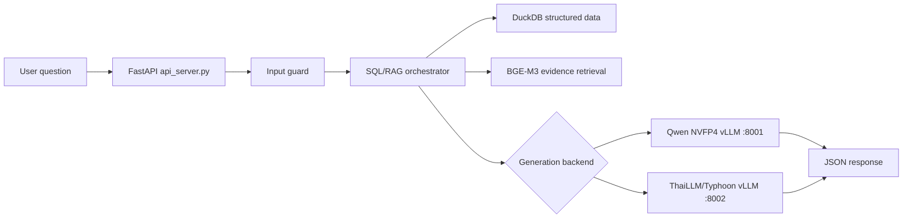

<!-- prettier-ignore -->
<div align="center">

# FahMai Agent

*A guarded SQL/RAG business-question agent with FastAPI, DuckDB, BGE-M3 retrieval, and OpenAI-compatible LLM backends.*


[Overview](#overview) • [Features](#features) • [Quick start](#quick-start) • [API](#api) • [Deployment](#deployment) • [Project structure](#project-structure)

</div>

FahMai Agent is a guarded business-question answering system that combines deterministic SQL tools, DuckDB-backed retrieval, BGE-M3 embeddings, and OpenAI-compatible LLM backends. It exposes a simple FastAPI contract so users can ask questions through `curl`, batch scripts, or any HTTP client.

The two public agent routes share the same SQL/RAG pipeline and safety layer. Only the generation backend changes.

> [!NOTE]
> The repository is still named `Enterprise-SQL-RAG-Agent`, but **FahMai Agent** is shorter, closer to the codebase naming, and easier to use in a README, demo, or GitHub About section.

> [!IMPORTANT]
> Large runtime artifacts such as DuckDB files, model weights, logs, and local snapshots are intentionally ignored by Git. Keep those files local or provision them separately for deployment.

## Overview

```text
User question
  FastAPI receives a question and assigns a request id

Safety route
  Optional input guard checks whether the request should continue

SQL/RAG orchestrator
  Routes the clean question, executes read-only SQL when needed, retrieves evidence, and builds context

Generation backend
  Calls an OpenAI-compatible vLLM endpoint for Qwen or ThaiLLM/Typhoon

JSON response
  Returns id, answer, and estimated or reported output token count
```

## Architecture



Both `/agent/local` and `/agent/thaillm` use the same database, retrieval code, router, deterministic SQL tools, and guard logic.

## Features

| Capability | What it provides |
| --- | --- |
| FastAPI contract | Stable HTTP routes for question answering and health checks |
| Shared SQL/RAG pipeline | One orchestrator used by both model backends |
| DuckDB execution | Read-only structured data lookup and computation |
| BGE-M3 retrieval | Evidence retrieval for documents, reports, renders, logs, and table context |
| Safety route | Input guard before SQL/RAG execution |
| Backend switching | Qwen route and ThaiLLM/Typhoon route with the same response shape |
| Batch evaluation | Scripts for running question sets and normalizing submissions |
| Deployment helpers | B200-oriented model and API launch scripts |

## Quick start

### 1. Install dependencies

```bash
pip install -r requirements.txt
```

### 2. Prepare runtime files

Create a local environment file:

```bash
cp .env.example .env
```

Place the DuckDB runtime file where the app expects it:

```text
data-parser/output/fahmai.duckdb
```

Then update `.env` for your environment:

```bash
FAHMAI_DATABASE=data-parser/output/fahmai.duckdb
FAHMAI_EMBEDDING_MODEL_PATH=/path/to/bge-m3
FAHMAI_LLM_API_BASE=http://127.0.0.1:8001/v1
FAHMAI_THAILLM_LLM_API_BASE=http://127.0.0.1:8002/v1
```

> [!TIP]
> Keep `FAHMAI_OFFLINE=true` when models and embeddings are already available locally. This makes deployment more predictable on offline or restricted hosts.

### 3. Start the API

Linux or macOS:

```bash
./scripts/api/start_api.sh
```

PowerShell:

```powershell
.\scripts\api\start_api.ps1
```

The API defaults to `0.0.0.0:8888`.

## API

### Health check

```bash
curl -sS http://127.0.0.1:8888/health
```

### Ask the local Qwen backend

```bash
curl -sS http://127.0.0.1:8888/agent/local \
  -H 'Content-Type: application/json' \
  -d '{"question":"MSRP ของสินค้ารหัส NT-LT-001 เป็นเท่าไหร่ครับ"}'
```

### Ask the ThaiLLM/Typhoon backend

```bash
curl -sS http://127.0.0.1:8888/agent/thaillm \
  -H 'Content-Type: application/json' \
  -d '{"question":"MSRP ของสินค้ารหัส NT-LT-001 เป็นเท่าไหร่ครับ"}'
```

### Response shape

```json
{
  "id": "generated-request-id",
  "answer": "final answer text",
  "total_output_token_count": 123
}
```

### Smoke test

```bash
FAHMAI_URL=http://127.0.0.1:8888/agent/thaillm ./scripts/smoke/test_agent_curl.sh
```

## Deployment

The deployment scripts assume model weights and Python environments already exist on the target host.

| Component | Default path or route |
| --- | --- |
| API environment | `/root/data/miniforge3/envs/fahmai` |
| ThaiLLM environment | `/root/data/miniforge3/envs/thaillm` |
| BGE-M3 embeddings | `/root/data/model/bge-m3` |
| Qwen backend | `http://127.0.0.1:8001/v1` |
| ThaiLLM/Typhoon backend | `http://127.0.0.1:8002/v1` |
| API server | `http://127.0.0.1:8888` |

Start model backends:

```bash
./scripts/models/serve_qwen_vllm.sh
./scripts/models/serve_thaillm.sh
```

Start the API on the deployment host:

```bash
FAHMAI_APP_DIR=/root/data/API-Ready ./scripts/api/start_fahmai_api.sh
```

> [!WARNING]
> Review GPU visibility, model paths, memory settings, and vLLM launcher assumptions before using the B200 scripts on a different machine.

## Batch evaluation

Run the orchestrator over the bundled question set:

```bash
./scripts/batch/run_questions.sh
```

Run only the first `N` questions:

```bash
./scripts/batch/run_questions.sh 10 smoke
```

Normalize a JSONL run into a submission CSV:

```bash
python data-parser/normalize_submission_answers.py \
  --sample-csv data/sample_submission.csv \
  --jsonl test_submission/orchestrator_results.jsonl \
  --output-csv test_submission/submission.csv \
  --fill-range 1-100 \
  --answer-format answer_only
```

## Verification

Run the safety-route tests:

```bash
python -m pytest safety_route/tests
```

Run a syntax check:

```bash
python -m py_compile api_server.py
```

## Configuration

Most behavior is controlled with environment variables. See [`.env.example`](./.env.example) for the full set.

| Variable | Purpose |
| --- | --- |
| `FAHMAI_DATABASE` | DuckDB file used by the SQL/RAG pipeline |
| `FAHMAI_EMBEDDING_MODEL_PATH` | Local BGE-M3 model path |
| `FAHMAI_LLM_API_BASE` | OpenAI-compatible Qwen backend URL |
| `FAHMAI_LLM_MODEL` | Qwen served-model name |
| `FAHMAI_THAILLM_LLM_API_BASE` | OpenAI-compatible ThaiLLM backend URL |
| `FAHMAI_THAILLM_LLM_MODEL` | ThaiLLM served-model name |
| `FAHMAI_ENABLE_INPUT_GUARD` | Enables the input guard |

## Project structure

```text
.
├── api_server.py                  # FastAPI app and HTTP response contract
├── data-parser/                   # SQL/RAG orchestrator, router, tools, and retrieval helpers
├── data-parser/output/            # Local DuckDB runtime files, ignored except .gitkeep
├── safety_route/                  # Input guard and clean-intent extraction
├── scripts/api/                   # API launchers for local and deployment usage
├── scripts/models/                # vLLM launchers for Qwen and ThaiLLM/Typhoon
├── scripts/batch/                 # Batch evaluation runner
├── scripts/smoke/                 # Curl smoke-test helper
├── data/questions.csv             # Evaluation or input questions
├── data/sample_submission.csv     # Submission template
└── docs/deployment.md             # Deployment and batch notes
```

## Documentation

- [Deployment notes](./docs/deployment.md)
- [Environment example](./.env.example)

## Naming recommendation

The current name, `Enterprise-SQL-RAG-Agent`, is accurate but long. **FahMai Agent** is shorter, follows the API naming already used in the code, and still describes a guarded SQL/RAG question-answering agent.
