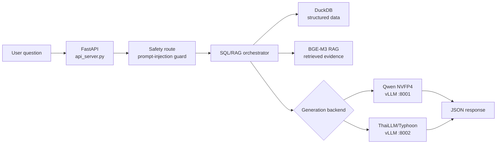

# Enterprise SQL/RAG Agent


Enterprise SQL/RAG Agent is a guarded business-question answering system that combines deterministic SQL tools, DuckDB-backed retrieval, BGE-M3 embeddings, and OpenAI-compatible LLM backends. It exposes a simple HTTP contract for users to `curl` questions and receive grounded answers from the same SQL/RAG flow.

The project currently supports two generation backends:

- **Qwen NVFP4 on B200** through `POST /agent/local`
- **ThaiLLM/Typhoon 8B** through `POST /agent/thaillm`

[Quick start](#quick-start) • [API](#api) • [Architecture](#architecture) • [B200 deployment](#b200-deployment) • [Project structure](#project-structure)

> [!NOTE]
> Large runtime artifacts such as DuckDB files, model weights, logs, and archived cleanup snapshots are intentionally ignored by Git. The repository is ready to push without uploading local data/model artifacts.

## Features

- **Shared SQL/RAG pipeline** for both model routes.
- **DuckDB execution layer** for structured business data.
- **RAG evidence retrieval** using BGE-M3 embeddings and hybrid scoring.
- **Prompt-injection safety route** before SQL/RAG execution.
- **OpenAI-compatible model calls** for vLLM-hosted backends.
- **B200-oriented launch scripts** for Qwen NVFP4 and ThaiLLM/Typhoon.
- **Curl-friendly API contract** for integration and smoke testing.

## Architecture



Both API routes use the same database, retrieval layer, router, SQL tools, and safety guard. Only the generation backend changes.

## Project Structure

```text
api_server.py                  FastAPI app and HTTP response contract
data-parser/                   SQL/RAG orchestrator, router, tools, entity resolver
data-parser/output/            Local DuckDB runtime files; ignored except .gitkeep
safety_route/                  Prompt-injection detection and safety routing
scripts/api/                   API launchers for local and B200 deployment
scripts/models/                vLLM launchers for Qwen and ThaiLLM/Typhoon
scripts/batch/                 Batch evaluation runner
scripts/smoke/                 Curl smoke test helper
data/questions.csv             Evaluation/input questions
data/sample_submission.csv     Submission template
docs/deployment.md             Detailed batch and deployment notes
```

## Quick Start

### 1. Install dependencies

```bash
pip install -r requirements.txt
```

### 2. Add runtime artifacts

Place the DuckDB file here:

```text
data-parser/output/fahmai.duckdb
```

Configure local paths and model endpoints:

```bash
cp .env.example .env
```

Update `.env` for your environment, especially:

```bash
FAHMAI_DATABASE=data-parser/output/fahmai.duckdb
FAHMAI_EMBEDDING_MODEL_PATH=/root/data/model/bge-m3
FAHMAI_LLM_API_BASE=http://127.0.0.1:8001/v1
FAHMAI_THAILLM_LLM_API_BASE=http://127.0.0.1:8002/v1
```

### 3. Start the API

```bash
./scripts/api/start_api.sh
```

PowerShell:

```powershell
.\scripts\api\start_api.ps1
```

The API defaults to `0.0.0.0:8888`.

## API

### Health Check

```bash
curl -sS http://127.0.0.1:8888/health
```

### Ask Qwen

```bash
curl -sS http://127.0.0.1:8888/agent/local \
  -H 'Content-Type: application/json' \
  -d '{"question":"MSRP ของสินค้ารหัส NT-LT-001 เป็นเท่าไหร่ครับ"}'
```

### Ask ThaiLLM/Typhoon

```bash
curl -sS http://127.0.0.1:8888/agent/thaillm \
  -H 'Content-Type: application/json' \
  -d '{"question":"MSRP ของสินค้ารหัส NT-LT-001 เป็นเท่าไหร่ครับ"}'
```

### Response Contract

```json
{
  "id": "generated-request-id",
  "answer": "final answer text",
  "total_output_token_count": 123
}
```

You can also use the included smoke-test helper:

```bash
FAHMAI_URL=http://127.0.0.1:8888/agent/thaillm ./scripts/smoke/test_agent_curl.sh
```

## B200 Deployment

The deployment scripts assume model weights and conda environments are already present on the target host:

- FahMai API env: `/root/data/miniforge3/envs/fahmai`
- ThaiLLM env: `/root/data/miniforge3/envs/thaillm`
- BGE-M3: `/root/data/model/bge-m3`
- Qwen NVFP4: `/root/data/model/Qwen3.6-35B-A3B-NVFP4`
- ThaiLLM/Typhoon: `/root/data/model/typhoon-s-thaillm-8b-instruct-research-preview`

Start the model backends:

```bash
./scripts/models/serve_qwen_vllm.sh
./scripts/models/serve_thaillm.sh
```

Then start the API:

```bash
FAHMAI_APP_DIR=/root/data/API-Ready ./scripts/api/start_fahmai_api.sh
```

Default internal routes:

| Route | Backend | vLLM URL |
|---|---|---|
| `/agent/local` | Qwen NVFP4 | `http://127.0.0.1:8001/v1` |
| `/agent/thaillm` | ThaiLLM/Typhoon | `http://127.0.0.1:8002/v1` |

> [!IMPORTANT]
> `CUDA_VISIBLE_DEVICES` is set to numeric device `0` in the B200 scripts because vLLM parses it as an integer. Do not replace it with a MIG UUID unless the launcher is updated and verified.

## Batch Evaluation

Run the orchestrator over the bundled questions:

```bash
./scripts/batch/run_questions.sh
```

Run only the first `N` questions:

```bash
./scripts/batch/run_questions.sh 10 smoke
```

Normalize a JSONL run into a submission CSV:

```bash
python data-parser/normalize_submission_answers.py \
  --sample-csv data/sample_submission.csv \
  --jsonl test_submission/orchestrator_results.jsonl \
  --output-csv test_submission/submission.csv \
  --fill-range 1-100 \
  --answer-format answer_only
```

## Verification

Run the safety-route test suite:

```bash
python -m pytest safety_route/tests
```

Run a Python syntax check:

```bash
python -m py_compile api_server.py
```

## Configuration

Most runtime behavior is controlled with environment variables. See [.env.example](.env.example) for the full set.

Common variables:

| Variable | Purpose |
|---|---|
| `FAHMAI_DATABASE` | DuckDB file used by the SQL/RAG pipeline |
| `FAHMAI_EMBEDDING_MODEL_PATH` | Local BGE-M3 model path |
| `FAHMAI_LLM_API_BASE` | OpenAI-compatible Qwen backend URL |
| `FAHMAI_LLM_MODEL` | Qwen served-model name |
| `FAHMAI_THAILLM_LLM_API_BASE` | OpenAI-compatible ThaiLLM backend URL |
| `FAHMAI_THAILLM_LLM_MODEL` | ThaiLLM served-model name |
| `FAHMAI_ENABLE_INPUT_GUARD` | Enables the prompt-injection safety route |

## GitHub Notes

Recommended repository name: `enterprise-sql-rag-agent`.

This repository intentionally tracks source code, scripts, docs, and small CSV fixtures only.

Ignored local artifacts include:

- `data-parser/output/*.duckdb`
- `_archive/`
- `logs/`
- `test_submission/`
- Python cache folders

More deployment detail lives in [docs/deployment.md](docs/deployment.md).
